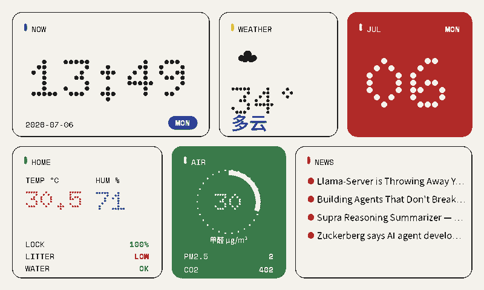
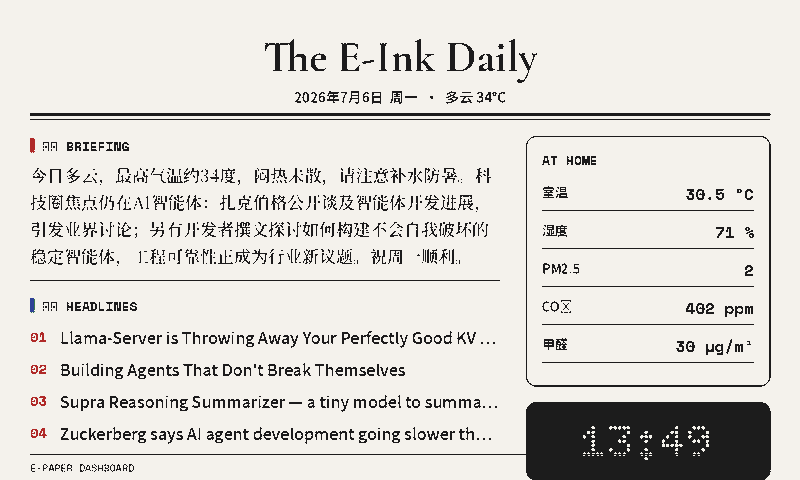
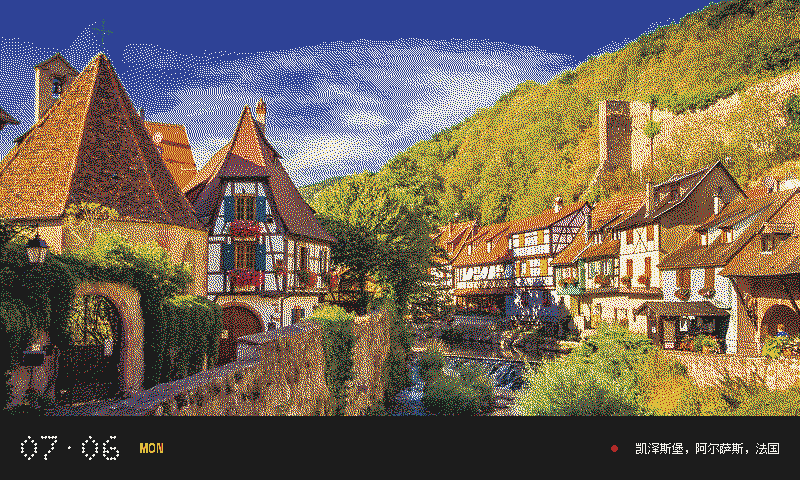
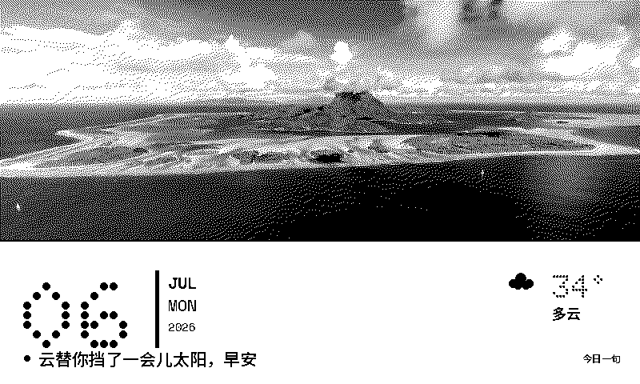
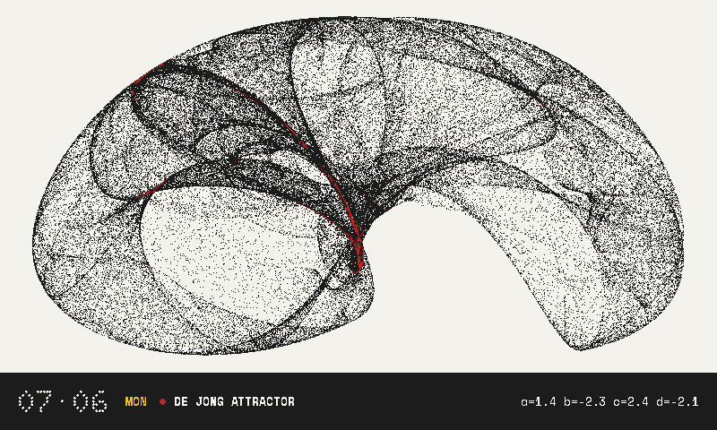
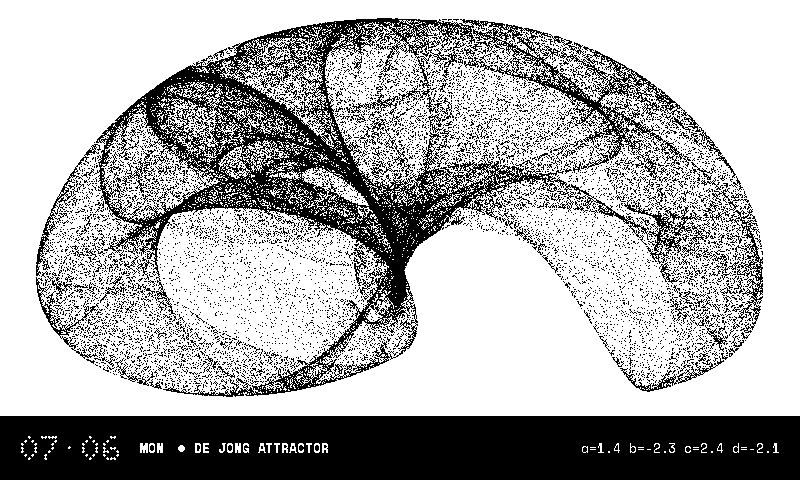

# E-Paper Dashboard

墨水屏智能家居仪表盘：服务端 Python 渲染 + ESPHome 固件拉图。同一套风格代码同时驱动
**黑白 1-bit** 和 **六色 Spectra 6 (E6)** 两种 800×480 面板，支持照片（NAS / Bing 壁纸 /
AI 生成）与 AI 个性化文本（claude / codex CLI 生成晨报、每日一句、图片描述）。

| nothing (E6) | journal (E6) |
|---|---|
|  |  |

| gallery (E6) | poster (B/W) |
|---|---|
|  |  |

| mathart (E6) | mathart (B/W) |
|---|---|
|  |  |

## 架构

渲染完全在服务端（任意常开 Linux 盒子）完成，屏端固件只做一件事：定时下载一张 PNG 并整屏刷新。
这样中文任意排版、照片抖动、AI 文本都不受设备端字库/内存限制。

```
┌─────────────── 常开机器 (cron, 每 10 分钟) ───────────────┐
│  renderer.rotate --panel bw|e6                            │
│    ├─ datasources: HA REST /api/states + FreshRSS 新闻    │
│    ├─ imagesource: Bing 壁纸 / NAS 目录 / Picsum / AI 生图 │
│    ├─ ai: claude/codex CLI → 晨报、每日一句、图片描述      │
│    ├─ styles/<风格>.render(panel, ctx) → 800×480 RGB      │
│    └─ panels: 1-bit 阈值/抖动 或 六色量化 → 设备 PNG       │
│  renderer.deploy → SSH → HA /config/www/eink/*.png        │
└───────────────────────────┬───────────────────────────────┘
                            │ HTTP GET /local/eink/dashboard[_e6].png
              ┌─────────────┴─────────────┐
        ESP32-S3 + Waveshare 7.5"   XIAO ESP32-S3 + GDEP073E01
        (1-bit, arduino 框架)        (Spectra 6, esp-idf 框架)
        online_image → 整屏 blit     online_image RGB565 → 整屏刷新 (~18s)
```

关键点：
- **面板抽象**（`renderer/panels.py`）：风格代码用语义色（black/red/green/blue/yellow/white）
  作画；黑白面板把所有墨色折叠为黑，E6 面板映射到六个恰好落进 ESPHome `epaper_spi`
  `color_to_hex()` 颜色桶的纯 RGB，并逐像素镜像该算法生成设备图 + 面板真实观感的 preview 图。
- **照片**必须抖动：黑白 → Floyd–Steinberg 1-bit；E6 → 误差扩散抖动到六色调色板。
  预抖动图像只能贴在 `ss=1` 画布上（缩放会毁掉抖动纹理）。
- **AI 结果按天/按图缓存**（`out/cache/`），10 分钟一次的 cron 只有每天第一跳付出 agent 调用。

## 硬件清单

| | 黑白面板 (bw) | 六色面板 (e6) |
|---|---|---|
| 屏幕 | Waveshare 7.5" v2, 800×480 1-bit | Good Display GDEP073E01 (7.3" E Ink Spectra 6) |
| 主控 | ESP32-S3-DevKitC-1（八线 PSRAM） | Seeed XIAO ESP32-S3（八线 PSRAM） |
| 驱动板 | Waveshare e-Paper HAT | GYS DEPG0730-Tboard-V01（DESPI-C73 等效，BS0 接地 = 4 线 SPI） |
| 固件 | `firmware/epaper-bw.yaml`（arduino） | `firmware/epaper-e6.yaml`（esp-idf，接线图见文件头注释） |
| 刷新 | 10 分钟整屏 | 10 分钟整屏（全刷 ~18s，勿更快，伤面板） |

服务端：任意常开 Linux 机器（本项目跑在一台 Proxmox 里的盒子上），需要能访问 HA 与外网。

## 快速开始

```bash
# 1. 依赖
uv venv .venv && uv pip install -p .venv/bin/python -r requirements.txt

# 2. 配置
cp .env.example .env        # 填 HA_URL/HA_TOKEN/HA_SSH_*，按需改图片源和播放列表
#    renderer/config.py 里把 ENTITIES 换成你自己的 HA 实体 ID

# 3. 渲染单帧（不上屏，看 out/*_preview.png）
set -a && source .env && set +a
.venv/bin/python -m renderer.render --panel e6 --style nothing

# 4. 渲染 + 推送到 HA（屏端 10 分钟内自动拉取）
.venv/bin/python -m renderer.render --panel e6 --style journal --deploy

# 5. 定时轮换（风格播放列表见 .env 的 EINK_PLAYLIST_*）
crontab -e   # 参考 config/crontab.example

# 固件（首次烧录用 USB，之后 OTA）
cd firmware && cp secrets.yaml.example secrets.yaml  # 填 WiFi 等
esphome run epaper-e6.yaml
```

## 风格

| 风格 | 内容 | 图片 | AI |
|---|---|---|---|
| `nothing` | Nothing UI 磁贴：时钟/天气/日历/家居/空气/新闻 | — | — |
| `gallery` | 全屏照片 + 底部日期/说明条 | 全屏 | 可选：图片描述（`EINK_AI_CAPTION=1`） |
| `poster` | 上 2/3 照片，下方超大日期 + 天气 + 每日一句 | 背景 | 每日一句（天气感知，日缓存） |
| `journal` | 报纸头版：AI 晨报导语 + 要闻 + 家居数据侧栏 | — | 晨报导语（新闻+天气综述，日缓存） |
| `mathart` | 程序生成数学图案 + 公式标注：Julia/Mandelbrot/牛顿分形/de Jong 吸引子/harmonograph，按日期轮换（numpy 计算，无网络依赖） | 代码生成 | — |

所有风格同时兼容两种面板；照片风格拉取失败时自动回退 `nothing`，屏幕永远不会白屏/报错。

## 图片来源（`EINK_PHOTO_SOURCE`）

- `bing` — Bing 每日壁纸（近 8 天随机，无需 key）
- `nas` — 本地/NAS 目录随机选图（`EINK_NAS_PHOTO_DIR`，如 NFS/SMB 挂载 `/mnt/fnOS/photos`，递归搜索）
- `picsum` — Lorem Picsum 随机图
- `ai` — 每日 AI 生成插画（主题按日轮换，日缓存；默认走 codex imagegen，
  或用 `EINK_IMAGEGEN_CMD='cmd --prompt {prompt} --out {out}'` 接任意生图后端）

## AI 集成

`renderer/ai.py` 直接调用本机的 agent CLI（自带鉴权，无需在此配 API key）：

- `claude -p --output-format json`（默认，装了就用）或 `codex exec`，由 `EINK_AI_BACKEND` 指定
- 文本（晨报/每日一句）按天缓存；图片描述按图片内容哈希缓存
- 全部调用失败都有降级：poster 用内置句子、journal 去掉导语、gallery 用图片源自带标题

## 扩展

- **加风格**：在 `renderer/styles/` 写一个 `render(panel, ctx) -> PIL.Image` 模块，
  注册进 `styles/__init__.py` 的 `STYLES`，即可用于 `--style` 与播放列表。
- **加面板**：在 `renderer/panels.py` 实现 `color/prepare_photo/export` 三个方法。
- 面向 coding agent 的复现与改造指南见 [AGENTS.md](AGENTS.md)。
